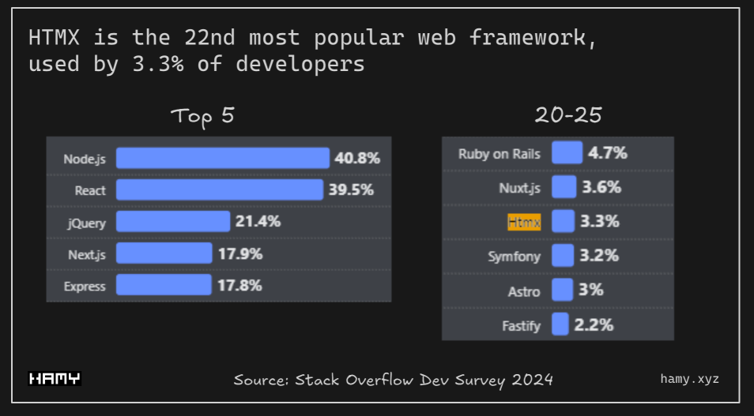
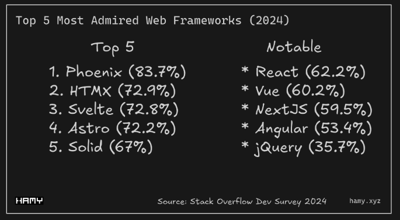

# HTMX in Kotlin - Project Report

## 1 Introduction

Modern web applications are often implemented as Single-Page Applications (SPAs) using frameworks such as React, Angular, or Vue. These approaches enable highly interactive user interfaces, but they also introduce significant complexity: large JavaScript bundles, complex build pipelines, and a strong separation between frontend and backend logic.

In contrast, classic server-side rendered applications send a full HTML page for each user interaction (for example, form submission or clicking a link). This architecture is simple and robust, but from a modern perspective often feels slow and less interactive.

The JavaScript library **HTMX** positions itself between these two extremes. It allows developers to access modern browser features directly from HTML, without building a full SPA [2]. Instead of JSON APIs and extensive JavaScript code, the concept of *HTML over the wire* moves back into focus: the server sends HTML fragments that are dynamically inserted into the DOM in the browser.

In the blog article *“A Quick Guide to HTMX in Kotlin”* by Codersee, it is shown how HTMX can be combined with a Kotlin backend (Ktor) to dynamically update user interfaces without building a separate JavaScript SPA [1]. This project work builds on that idea, but uses **Spring Boot** as the backend framework and implements its own example application to demonstrate the integration.

### 1.1 Objectives of the project

The objectives of this project are:

- to explain the fundamental concepts of HTMX,
- to show how HTMX can be integrated with a Kotlin backend (here: Spring Boot),
- to implement and document a working example application,
- and to discuss advantages and disadvantages of this approach compared to classical SPA architectures and purely server-side applications.

The example application implements a simple in-memory message list. The user interface is enhanced with HTMX so that messages can be loaded and added without reloading the entire page.

### 1.2 Structure of this report

The report is structured as follows:

- Chapter 2 introduces the necessary basics of web architectures, Kotlin in the backend, and HTMX.
- Chapter 3 details the core concepts and mechanisms of HTMX.
- Chapter 4 describes different architectural variants of “HTMX in Kotlin” and relates them to the Codersee example.
- Chapter 5 documents the implementation of the example application with Spring Boot.
- Chapter 6 sketches extended scenarios that could be implemented with HTMX in Kotlin.
- Chapter 7 compares and evaluates the approach.
- Chapter 8 explores how the approaches can work with a multipurpose backend.
- Chapter 9 summarizes the findings and gives an outlook on possible future extensions.

---

## 2 Fundamentals

### 2.1 Overview of web architectures

To put HTMX into context, it is useful to distinguish between three common architectural approaches:

1. **Classic server-side rendering**

   The browser sends an HTTP request to the server for each user interaction (for example, form submission or clicking a link). The server renders a full HTML page and sends it back. The browser then reloads the entire page.  
   Advantages:
   - simple architecture,
   - little JavaScript required,
   - good SEO.  
   Disadvantages:
   - full page reloads for many interactions,
   - can feel slow and less responsive.

2. **Single-Page Applications (SPA)**

   A JavaScript application runs in the browser, typically communicates with the backend via JSON APIs, and is responsible for DOM updates on the client.  
   Advantages:
   - highly interactive user interfaces,
   - smooth user experience without full page reloads.  
   Disadvantages:
   - increased complexity (state management, routing, build tooling),
   - large initial JavaScript payload,
   - business logic is split between frontend and backend.

3. **HTML over the wire / hypermedia-driven applications**

   The server renders HTML fragments which are inserted into existing page sections. JavaScript mainly acts as a thin transport and integration layer. HTMX is a prominent example of this approach.  
   Advantages:
   - most business logic stays in the backend,
   - frontend stays simple (HTML plus a bit of JavaScript via HTMX),
   - still allows interactive user interfaces.

HTMX can be understood as a middle ground between classic server-side rendering and SPAs: it relies on standard HTTP semantics and HTML to increase interactivity, without requiring a full client-side application.

4. **History and position of HTMX compared to SPA frameworks**

HTMX is a relatively young library: version 1.0.0 was released in November 2020 as a redesigned successor of intercooler.js, which had originally been created and released around 2013 [3][4]. In contrast, the main single-page application (SPA) frameworks and libraries are significantly older. React was open-sourced by Facebook in 2013 [5], the first public release of Vue.js followed in 2014 [6], and Angular (as a complete rewrite of AngularJS) was introduced in 2016 [7]. HTMX therefore appeared after almost a decade of SPA-dominated frontend development and can be seen as a deliberate response to the increasing complexity of large client-side frameworks. Instead of moving more and more logic into the browser, HTMX aims to bring back server-driven HTML while still providing modern interactivity through declarative attributes on standard HTML elements.

The chart below shows the increasing popularity of HTMX over the years measured by the amount of Github Stars that reflect the popularity of the library.
[](https://www.star-history.com/#bigskysoftware/htmx&type=date&legend=top-left)

The picture below shows the popularity of HTMX in the year 2024 making it the 22nd most popular web framework. 

(https://hamy.xyz/blog/2024-09_the-state-of-htmx)
(https://survey.stackoverflow.co/2024/technology#1-web-frameworks-and-technologies)

And the last picture shows how admired HTMX as library is, according to Stack Overflow's 2024 Dev Survey. 

(https://hamy.xyz/blog/2024-09_the-state-of-htmx)
(https://survey.stackoverflow.co/2024/technology#1-web-frameworks-and-technologies)


### 2.2 Kotlin in the backend

Kotlin is a modern, statically typed language targeting the JVM. It is widely used in Android development, but also increasingly for server-side applications (for example with Spring Boot or Ktor) [9]. Relevant properties for backend development include:

- null safety enforced by the type system,
- expressive syntax and data classes,
- support for DSL-like APIs (for example the HTML DSL in Ktor),
- interoperability with existing Java libraries.

In this project, Kotlin is used together with **Spring Boot**. Spring Boot provides [8]:

- an embedded web server (e.g. Tomcat),
- an established MVC model with controllers,
- strong integration with the Spring ecosystem.

The example application shows that HTMX can be integrated into a classical Spring MVC application without any special libraries beyond HTMX itself.

### 2.3 HTMX - basic idea

HTMX is a JavaScript library that is primarily used through HTML attributes. Instead of writing imperative JavaScript code, HTML elements are decorated with `hx-*` attributes to trigger HTTP requests and insert the responses into the DOM [2].

Some central attributes are:

- `hx-get`: executes an HTTP GET request,
- `hx-post`: executes an HTTP POST request,
- `hx-trigger`: defines when the request should be sent (for example `load`, `click`, `changed`),
- `hx-target`: specifies which DOM element should be updated with the response,
- `hx-swap`: defines how the response is inserted into the target element,
- `hx-swap-oob`: enables *out-of-band* updates of DOM elements that are not the main target of the request.

The library therefore acts as a small client-side layer which drives HTTP requests from HTML and processes the server’s HTML responses. HTMX itself is backend-agnostic; in this project, a Kotlin/Spring Boot backend is used.

---

## 3 HTMX concepts and mechanisms

This chapter describes the most important HTMX concepts in more detail. These basics are then used in the implementation chapter to explain the example application.

### 3.1 HTTP methods and `hx-*` attributes

HTMX extends HTML elements with attributes that trigger HTTP requests. Some examples:

- `hx-get="/messages"`  
  Triggers a GET request to `/messages`.
- `hx-post="/add-message"`  
  Triggers a POST request, typically including form data.
- `hx-put` and `hx-delete`  
  Can be used for update and delete operations.

The server’s response is interpreted as HTML and, by default, applied to the DOM element specified by the `hx-target` attribute.

### 3.2 Triggers and events

The `hx-trigger` attribute defines when a request is fired. Common examples include:

- `hx-trigger="load"` - when the element is loaded into the DOM,
- `hx-trigger="click"` - when the element is clicked,
- `hx-trigger="change"` - when the value of an input field changes.

In the example application, `hx-trigger="load"` is used to load the initial message list as soon as the page has been loaded.

### 3.3 Target element and swap strategy

Two further key attributes are:

- `hx-target`  
  Defines which DOM element should be updated with the server response. The target is specified via CSS selector (for example `#messages`).
- `hx-swap`  
  Defines how the response is inserted into the target, for example:
  - `innerHTML` (default): replaces the inner content of the target element,
  - `outerHTML`: replaces the element itself,
  - `beforebegin`, `afterbegin`, `beforeend`, `afterend`: insert content relative to the element.

In the demo application, `hx-target="#messages"` and `hx-swap="innerHTML"` are used to completely replace the HTML representation of the message list.

### 3.4 Out-of-band updates with `hx-swap-oob`

One special feature of HTMX is out-of-band updates. If an element in the server’s response has the attribute `hx-swap-oob="true"`, it will not be inserted at the response’s main target location. Instead, HTMX looks for a matching element elsewhere in the DOM and replaces or updates it there.

In the example application this is used to clear the input field after submitting the form, without configuring the entire form as the request target. The backend sends an additional `<input>` element with `hx-swap-oob="true"`, which replaces the existing input field in the form.

---

## 4 HTMX with Kotlin - architectural variants

HTMX is not tied to a specific backend framework. In the Kotlin ecosystem, two popular options are:

1. **Ktor + HTMX**  
   In the Codersee example, HTMX is combined with Ktor. Ktor allows generating HTML using a Kotlin DSL. Routes can return HTML pages or fragments directly from code. HTMX integration means that controllers return HTML and that the generated templates contain appropriate `hx-*` attributes.

2. **Spring Boot + HTMX**  
   In this project, Spring Boot is used. Spring MVC controllers can return `String` values which represent HTML fragments. HTMX integration is done by:
   - returning HTML fragments instead of JSON from controllers,
   - using HTMX in the frontend via a CDN and `hx-*` attributes,
   - avoiding any heavy client-side frameworks.

In both variants, the business logic remains in the Kotlin backend. The browser primarily acts as a rendering client for HTML, enriched with HTMX for dynamic updates.

---

## 5 Implementation of the example application

This chapter documents the implementation of the small message application developed for this project. The full source code is available in a GitHub repository and is organized into two subprojects:

```text
htmx-kotlin/
├─ htmx-be/   // Spring Boot backend (Kotlin)
└─ htmx-fe/   // Static frontend (HTML + CSS + HTMX)
```

### 5.1 Requirements

The example application is intended to fulfill the following functional requirements:

- A list of text messages is displayed on the page.
- New messages can be added via a form.
- The message list should update without reloading the entire page.
- The implementation should be minimal (no database, no authentication) to keep the focus on HTMX plus Kotlin.

### 5.2 Backend: Spring Boot application

The Spring Boot application is started by the `HtmxBeApplication` class:

```kotlin
@SpringBootApplication
class HtmxBeApplication

fun main(args: Array<String>) {
    runApplication<HtmxBeApplication>(*args)
}
```

When started, an embedded web server listens on port 8080 and handles incoming HTTP requests.

#### 5.2.1 Data model and repository

First, a simple data class represents a message:

```kotlin
data class Message(
    val id: Long,
    val text: String
)
```

Messages are stored in an in-memory repository:

```kotlin
@Repository
class MessageRepository {
    private val seq = AtomicLong(1)
    private val data = CopyOnWriteArrayList<Message>().apply {
        add(Message(seq.getAndIncrement(), "I am working on the topic HTMX"))
        add(Message(seq.getAndIncrement(), "This is for my Projektarbeit 2 in Informatik Master"))
        add(Message(seq.getAndIncrement(), "I will have to show how HTMX works with a Kotlin Backend"))
    }

    fun findAll(): List<Message> = data.toList()

    fun add(text: String): Message {
        val m = Message(seq.getAndIncrement(), text)
        data.add(m)
        return m
    }
}
```

Key points:

- A real database is intentionally not used; data is kept in memory for simplicity.
- `AtomicLong` generates unique IDs.
- `CopyOnWriteArrayList` provides thread-safe access.

#### 5.2.2 Service layer

Domain logic is encapsulated in a service:

```kotlin
@Service
class MessageService(private val repo: MessageRepository) {

    fun getMessages(): List<Message> = repo.findAll()

    fun addMessage(text: String): List<Message> {
        require(text.isNotBlank()) { "message must not be blank" }
        repo.add(text.trim())
        return repo.findAll()
    }
}
```

The service:

- loads all messages,
- validates the input (`text` must not be blank),
- adds a new message,
- returns the updated list of messages.

#### 5.2.3 Controller and HTML rendering

The central entry point for the frontend is the `MessageController`:

```kotlin
@RestController
@CrossOrigin(
    origins = [
        "http://localhost:63342", "http://127.0.0.1:63342",
        "http://localhost:5500", "http://127.0.0.1:5500"
    ]
)
class MessageController(private val service: MessageService) {

    @GetMapping("/messages", produces = [MediaType.TEXT_HTML_VALUE])
    fun messagesHtml(): String = renderList(service.getMessages())

    @PostMapping(
        "/add-message",
        consumes = [MediaType.APPLICATION_FORM_URLENCODED_VALUE],
        produces = [MediaType.TEXT_HTML_VALUE]
    )
    fun addMessage(@RequestParam("message") text: String): String {
        val updated = service.addMessage(text)

        return """
        ${'$'}{renderList(updated)}
        <input type="text" name="message" placeholder="Your Message" value="" hx-swap-oob="true">
        """.trimIndent()
    }

    private fun renderList(items: List<Message>): String =
        buildString {
            append("<ul style='margin:0;padding-left:1.2rem'>")
            for (m in items) append("<li>#${'$'}{m.id}: ${'$'}{escape(m.text)}</li>")
            if (items.isEmpty()) append("<li><em>No messages</em></li>")
            append("</ul>")
        }

    private fun escape(s: String) = buildString {
        for (c in s) append(
            when (c) {
                '<' -> "&lt;"
                '>' -> "&gt;"
                '&' -> "&amp;"
                '"' -> "&quot;"
                ''' -> "&#39;"
                else -> c
            }
        )
    }
}
```

Important aspects for HTMX:

- Both endpoints produce `text/html`.
- `GET /messages` returns the HTML representation of the message list.
- `POST /add-message` returns
  - the updated list as HTML and
  - an additional `input` element with `hx-swap-oob="true"` to update the input field in the frontend.

The `renderList` method builds a `<ul>` element with `<li>` entries for each message. The `escape` method ensures that user input is not interpreted as HTML, which prevents simple HTML injection attacks.

#### 5.2.4 CORS configuration

Because the frontend runs under a different origin (e.g. `localhost:5500`), CORS must be configured to allow cross-origin requests:

```kotlin
@Configuration
class WebCorsConfig : WebMvcConfigurer {
    override fun addCorsMappings(registry: CorsRegistry) {
        registry.addMapping("/**")
            .allowedOrigins(
                "http://localhost:63342", "http://127.0.0.1:63342",
                "http://localhost:5500", "http://127.0.0.1:5500"
            )
            .allowedMethods("GET", "POST", "PUT", "DELETE", "OPTIONS")
    }
}
```

This configuration allows requests from typical local development servers such as VS Code Live Server or IntelliJ’s built-in web server.

### 5.3 Frontend: HTML page with HTMX

The frontend consists of a static HTML file (`index.html`) and a small CSS file.

#### 5.3.1 Including HTMX

In the `<head>` of the HTML file, HTMX is loaded via CDN:

```html
<script src="https://cdn.jsdelivr.net/npm/htmx.org@2.0.7"></script>
<script>
    htmx.config.selfRequestsOnly = false;  // allow cross-origin requests
</script>
```

The configuration `selfRequestsOnly = false` allows HTMX to send requests to a different origin, in this case the backend at `http://localhost:8080`.

#### 5.3.2 Loading the message list

In the `<body>`, a `div` is responsible for displaying the messages:

```html
<div id="messages"
     hx-get="http://localhost:8080/messages"
     hx-trigger="load">
    Loading Messages...
</div>
```

- `hx-get` triggers a GET request to `/messages`.
- `hx-trigger="load"` ensures that the request is executed as soon as the element has been loaded into the DOM.
- The HTML list (`<ul>...</ul>`) sent by the server replaces the content of `div#messages`.

#### 5.3.3 Form for adding messages

Directly below the list, there is a form for adding new messages:

```html
<form hx-post="http://localhost:8080/add-message"
      hx-target="#messages"
      hx-swap="innerHTML">
    <input type="text" name="message" placeholder="Your Message">
    <button type="submit">Submit &raquo;</button>
</form>
```

- `hx-post` sends a POST request to `/add-message` when the form is submitted.
- Form data is sent as `application/x-www-form-urlencoded`.
- `hx-target="#messages"` specifies that the response HTML should be applied to `div#messages`.
- `hx-swap="innerHTML"` replaces only the inner content of the target element.

The server response consists of:

1. an updated HTML list (`<ul>...</ul>`) and  
2. an `input` element with `hx-swap-oob="true"`.

HTMX first updates `#messages` with the new list and then replaces the existing input field with the out-of-band element. In practice, this means that the input field is cleared after submission.

### 5.4 User flow

From the user’s perspective, the flow looks as follows:

1. The user opens the frontend page via a local development server (for example `http://127.0.0.1:5500/index.html`).
2. When the page loads, HTMX fires a GET request to `/messages`, and the current message list is displayed.
3. The user enters a new message into the form and clicks “Submit”.
4. HTMX sends a POST request to `/add-message` with the form contents.
5. The backend adds the new message to the in-memory list and returns the updated list plus the out-of-band input element.
6. HTMX updates the DOM:
   - the list is refreshed,
   - the input field is cleared.

All of this happens without a full page reload. Business logic and HTML generation remain entirely on the server side.

---

## 6 Extended scenarios with HTMX in Kotlin

The current example application only covers a small subset of HTMX’s capabilities. In a larger project, the following scenarios could be explored:

### 6.1 Full CRUD interfaces

Instead of only adding messages, items could also be:

- edited (update),
- deleted (delete).

HTMX provides suitable attributes (`hx-put`, `hx-delete`) for these operations. Combined with a Kotlin backend (Spring Boot or Ktor), classical CRUD applications can be built where rows in a table or individual forms are dynamically updated.

### 6.2 Pagination and lazy loading

For larger data sets, the message list could be paginated. HTMX can be used to:

- load additional items via a “Load more” button,
- or automatically load further content when scrolling (using appropriate triggers).

### 6.3 Validation and error handling

Another extension would be to integrate validation and error feedback:

- use Bean Validation in the Kotlin backend,
- return HTML fragments that include error messages,
- insert these error messages into dedicated areas using `hx-target` and `hx-swap`.

### 6.4 Integration with template engines

In the demo application, HTML fragments are built manually as strings. In a real-world project, using a template engine (such as Thymeleaf) is usually more maintainable. HTMX can be combined with server-side templates by defining partial templates that are rendered and returned as fragments.

---

## 7 Comparison and evaluation

### 7.1 HTMX + Kotlin vs. classical SPA

Compared to a classical SPA architecture, the following picture emerges:

**Advantages of HTMX + Kotlin:**

- lower complexity in the frontend: no large JavaScript application is required,
- business logic stays in the backend and remains strongly typed,
- a separate JSON API layer is not strictly necessary; the server can return HTML directly,
- simpler SEO and faster initial load times due to server-side rendering.

**Disadvantages and limitations:**

- very complex client-side interactions and offline capabilities are harder to achieve with pure HTML fragments,
- advanced client-side state management is not the primary focus of this approach,
- frontend developers who are used to SPA frameworks need to adapt to a different style of development.

### 7.2 HTMX + Kotlin vs. pure server-side rendering

Compared to classic server-side rendering without HTMX, using HTMX offers:

- a better user experience: parts of the page can be updated without reloading the entire document,
- more granular interactions without writing large amounts of JavaScript,
- a familiar programming model (controllers, templates) extended with fragment-based updates.

The additional effort is mostly in adding appropriate `hx-*` attributes and designing endpoints that return HTML fragments.

---

## 8. Multipurpose backends and coexistence with HTMX

In many real-world systems the backend is not built exclusively for a single web user interface, but serves multiple types of clients at the same time. Typical consumers include:

- browser-based applications (classical server-rendered pages, SPAs, or HTMX-based UIs),
- native mobile apps,
- other backend services (for example via REST or gRPC),
- integration or batch processes.

In such a setting the backend is usually expected to expose a **stable JSON API** that is independent of any particular frontend technology. When HTMX is introduced on top of this, the question arises how HTML-over-the-wire endpoints can coexist with existing JSON endpoints without making the architecture brittle.

This section outlines three common strategies and discusses their trade-offs. It then explains which approach is used in the project.

### 8.1 Separation of concerns: shared services, separate presentation layers

A useful way to structure a multipurpose backend is to distinguish between:

- a **shared domain and service layer** (business logic, validation, persistence),
- multiple **presentation layers** on top of it:
    - one or more JSON APIs (for SPAs, mobile apps, other services),
    - one or more HTML/HTMX endpoints for server-driven web interfaces.

With this separation the business logic is implemented only once, while different clients can receive data in the representation that fits them best.

### Strategy 1: Separate endpoints and controllers (recommended)

The most straightforward and maintainable approach is to expose **different endpoints** for JSON and HTMX/HTML, even if they use the same service layer internally. For example:

```kotlin
@RestController
@RequestMapping("/api/messages")
class MessageApiController(private val service: MessageService) {

    @GetMapping(produces = [MediaType.APPLICATION_JSON_VALUE])
    fun getMessagesJson(): List<MessageDto> =
        service.getMessages().map { MessageDto.from(it) }
}
```

and

```kotlin
@RestController
@RequestMapping("/htmx/messages")
class MessageHtmxController(private val service: MessageService) {

    @GetMapping(produces = [MediaType.TEXT_HTML_VALUE])
    fun getMessagesHtml(): String =
        renderList(service.getMessages())
}
```

Characteristics of this approach:

- The **service layer** (`MessageService`) is shared.
- The JSON API (`/api/messages`) is clearly separated from the HTMX endpoints (`/htmx/messages`).
- Documentation, monitoring, and testing can treat the JSON API like any other public interface, while the HTMX endpoints can be considered part of a specific web user interface.
- There is no hidden coupling to a specific frontend; HTMX is just one additional consumer.

For multipurpose backends this strategy usually provides the best clarity and long-term maintainability, because responsibilities are explicit and each endpoint has a single, well-defined contract.

### Strategy 2: Content negotiation via `Accept` header

A second option is to use **HTTP content negotiation** on the same URL. Spring Boot allows defining multiple handler methods for the same path but different `produces` values:

```kotlin
@GetMapping("/messages", produces = [MediaType.APPLICATION_JSON_VALUE])
fun getMessagesJson(): List<MessageDto> = ...

@GetMapping("/messages", produces = [MediaType.TEXT_HTML_VALUE])
fun getMessagesHtml(): String = ...
```

Clients that send `Accept: application/json` will receive JSON, whereas HTMX can be configured (or left with its defaults) to request `text/html`.

Advantages:

- The URL space stays smaller: `/messages` is the single logical resource.
- The distinction between representations uses standard HTTP mechanisms.

Disadvantages:

- Debugging can be more difficult if the wrong `Accept` header is sent.
- The behaviour of an endpoint is no longer obvious when looking only at the URL; one has to inspect the content types as well.
- Tooling (for example API documentation generators) may require additional configuration to represent both variants correctly.

This strategy is technically sound but often better suited for mature teams and projects that already use content negotiation consistently.

### Strategy 3: Switching behaviour based on the `HX-Request` header

HTMX automatically sends a request header `HX-Request: true` for its requests. A controller can inspect this header and return different representations from a single method:

```kotlin
@GetMapping("/messages")
fun messages(request: HttpServletRequest): Any {
    val messages = service.getMessages()
    return if (request.getHeader("HX-Request") == "true") {
        renderList(messages)      // HTML for HTMX
    } else {
        messages.map { MessageDto.from(it) }  // JSON for other clients
    }
}
```

Although this can be convenient for small applications and prototypes, it has important downsides in a multipurpose backend:

- One endpoint now has **two responsibilities** (API and view rendering).
- The response format is determined by a non-standard header rather than HTTP content negotiation.
- It becomes harder to document, test, and evolve the contract independently for different clients.

For these reasons this strategy is usually not recommended for larger systems, even though it can be acceptable in simple demos.

### 8.2 Relation to the Backend-for-Frontend pattern

In more complex environments, it is common to introduce a **Backend-for-Frontend (BFF)** layer that sits in front of shared domain services. A BFF is tailored to the needs of a specific user interface (for example a web UI or a mobile app) and is responsible for:

- aggregating data from multiple internal services,
- shaping responses in a frontend-friendly format (HTML for HTMX, JSON suited to the UI’s view models),
- enforcing UI-specific security and performance requirements.

HTMX endpoints fit naturally into such a BFF layer: they can expose HTML fragments optimised for the HTMX-based UI, while other backends or APIs continue to use JSON or other protocols.

### 8.3 Approach used in this project

The example application in this project is intentionally small and focused on demonstrating HTMX with a Kotlin/Spring Boot backend. It currently provides **HTML endpoints specifically designed for the HTMX-based frontend** and does not expose a separate public JSON API.

However, the design is compatible with the **separate endpoints / controllers** strategy described above. The existing `MessageService` and repository layer are already independent of the presentation format. If the application were to be extended into a multipurpose backend, one could:

- keep the current HTMX-specific controllers (for HTML fragments), and
- add additional controllers under `/api/...` that expose the same data as JSON for other clients.

In other words, the project follows the idea of a shared service layer with distinct controllers for different representations, which is the recommended approach when HTMX coexists with other consumers in a multipurpose backend.


---

## 9 Conclusion and outlook

This project has shown how HTMX can be used in combination with a Kotlin backend to build interactive web interfaces without heavy SPA frameworks. Building on an existing tutorial that combines HTMX with Kotlin, an own example application using Spring Boot and a static HTMX frontend was developed and analyzed.

The implementation demonstrates that:

- HTMX integrates smoothly with Spring Boot,
- the HTML-over-the-wire approach works well with Kotlin,
- interactive user interfaces are possible without large JavaScript code bases.

HTMX and Kotlin are particularly suitable for applications where:

- frontend complexity should remain limited,
- server-side logic is central,
- short development cycles and simple deployments are important.

For more complex scenarios - such as very rich client-side interactions, offline support, or highly dynamic UIs - classical SPA approaches may still be preferable. Hybrid architectures, where some parts are implemented as SPAs and others with HTMX, are also an interesting option.

### 9.1 Possible extensions

Future work on the demo application could include:

- persisting messages in a database (for example PostgreSQL) instead of in-memory lists,
- extending the app to a full CRUD interface with edit and delete functionality,
- integrating form validation and error message display,
- using a server-side template engine for better structure and reusability of HTML fragments,
- exploring additional HTMX features such as `hx-push-url`, `hx-boost`, or visual loading indicators.

Through these extensions, the practicality of HTMX in real-world Kotlin applications could be evaluated in more depth.

---

## 9 References

[1] Codersee: *A Quick Guide to HTMX in Kotlin* (blog article, accessed 2026).  
[2] HTMX: Official documentation, https://htmx.org (accessed 2026).  
[3] HTMX: GitHub repository and release notes, especially version 1.0.0 (accessed 2026).  
[4] intercooler.js: Project documentation and archive, original hypermedia/AJAX library preceding HTMX (accessed 2026).  
[5] React: Official documentation and history, https://react.dev (accessed 2026).  
[6] Vue.js: Official documentation and release history, https://vuejs.org (accessed 2026).  
[7] Angular: Official documentation, https://angular.io (accessed 2026).  
[8] Spring Boot: Reference documentation, https://spring.io/projects/spring-boot (accessed 2026).  
[9] Kotlin: Language reference, https://kotlinlang.org/docs/reference/ (accessed 2026).